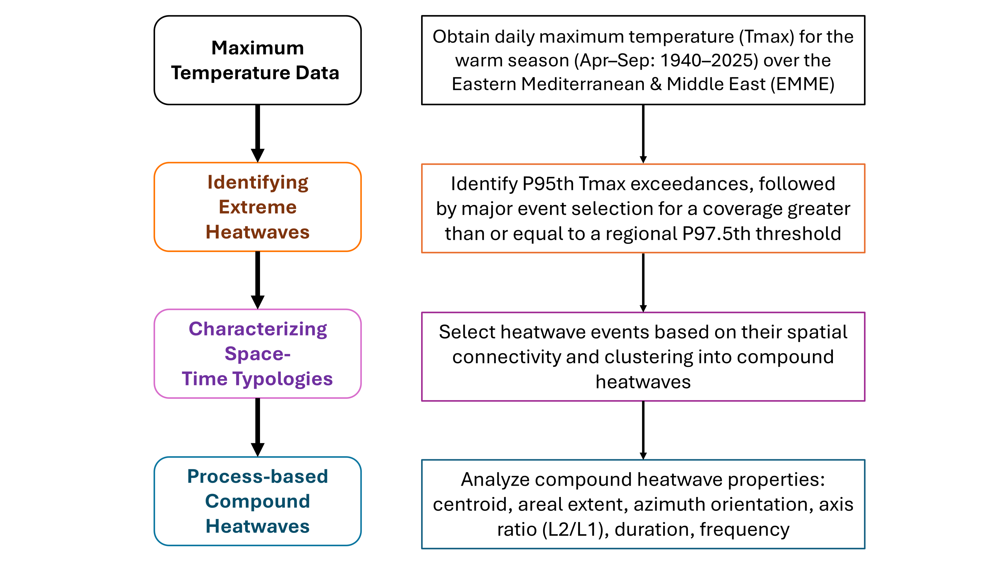

# SCORCH-Compound-Heatwave-Typologies

<!-- GitHub metadata snapshot, 6 October 2026: 394,370 code bytes; repository
size 162,290 KiB; Python and R. Static badges work while the repository is
private. Refresh these values after relevant changes or use live GitHub badges
once the repository is public. Repository size includes Git history. -->
[](LICENSE)
[](scripts/)
[](https://github.com/fawazbouhamad/compound-heatwave-typologies-SCORCH)
[](supporting_files/instructions/reproduction_guide.md)
[](https://github.com/fawazbouhamad/compound-heatwave-typologies-SCORCH/commits/main/)

A repo for *Understanding Compound Space-Time Typologies of Large-Scale Extreme
Heatwaves* by **Fawaz Bouhamad and Nasser Najibi** (manuscript in preparation).

The repository contains the scripts, catalogs, figures, tables and supporting
materials used in the study. **SCORCH** stands for **Spatiotemporal
Classification of Regional Compound Heatwaves**, applied here to the Eastern
Mediterranean and Middle East. The workflow below summarizes the SCORCH
framework.



## Processed temperature dataset

The processed temperature dataset is archived on Zenodo as **version 1.0.0**:

[](https://doi.org/10.5281/zenodo.21717874)

The record's file `SCORCH_data.zip` (MD5 `80772df9410306cbc419191d0dcb824c`)
contains `scorch_data/tmax_processed.nc` (SHA-256
`fc080880b6f2065fb5eec9fe9dce71abdfdc44a72d1ae91e50abdd278fadaa90`), a NetCDF
file containing one daily maximum temperature value for every study grid cell
on every warm-season date.

| Property | Coverage |
|---|---|
| Variable | Daily maximum 2-m air temperature (Tmax), in °C |
| Grid | 1° × 1°; 1,800 cells |
| Region | Eastern Mediterranean and Middle East: 10–46°N, 20–70°E |
| Period | April–September in every year from 1940 to 2025 |
| Dates | 15,738, with no missing temperature values |
| File size | Approximately 84.7 MB |

The data were prepared from hourly ERA5 2-m temperatures by calculating the
daily maximum of each UTC calendar day at 0.25° resolution and averaging, in
each 1° cell, the daily maxima of its complete 4 × 4 block of 0.25° points.
The reproduction steps start from this prepared file; the earlier processing
from hourly ERA5 was completed outside this repository.

## Reproduction instructions

See the [reproduction guide](supporting_files/instructions/reproduction_guide.md)
for the manuscript and Supporting Information steps, expected outputs,
and comparisons used to inform study decisions.

## How to cite

Until the manuscript is published, use the following reference and record the
repository revision used:

Bouhamad, F., and Najibi, N. *Understanding Compound Space-Time Typologies of
Large-Scale Extreme Heatwaves*. Manuscript in preparation.

```bibtex
@unpublished{bouhamad_najibi_scorch,
  title  = {Understanding Compound Space-Time Typologies of Large-Scale Extreme Heatwaves},
  author = {Bouhamad, Fawaz and Najibi, Nasser},
  note   = {Manuscript in preparation},
  url    = {https://github.com/fawazbouhamad/compound-heatwave-typologies-SCORCH}
}
```

Use the final article citation once published, and also cite the
[Zenodo dataset](https://doi.org/10.5281/zenodo.21717874) when using these data.

## Issues and comments

- For problems running the scripts or installing the required packages, open
  an issue in the [Issues tab](https://github.com/fawazbouhamad/compound-heatwave-typologies-SCORCH/issues).
- For comments or scientific questions, contact
  Fawaz Bouhamad or [Nasser Najibi](https://nassernajibi.com/) directly.

## Disclaimer

**Disclaimer:** Use of the scripts, functions and documentation is at your own
risk. These materials are provided **AS IS**, without warranty of any kind.
To the extent permitted by applicable law, the authors and developers disclaim
all express or implied warranties, including merchantability and fitness for
a particular purpose. Unless required by applicable law or agreed to in
writing, the authors and developers shall not be liable for damages arising
from the use of, or inability to use, these materials, including loss of data,
damage to systems, or other direct, indirect, incidental or consequential losses.

The views expressed in this repository and associated articles are those of
the authors and do not necessarily reflect the views of funding agencies,
affiliated universities or the U.S. Government. The authors may update this
disclaimer in future repository revisions. This notice does not change rights
granted under the applicable licenses.

## License

Code is licensed under [GPL-3.0-only](LICENSE). Author-created data and artwork
are CC BY 4.0; third-party data retain their original terms. Earlier public
code revisions under MIT retain that licence. Derived temperature data and
figures contain modified Copernicus Climate Change Service information 2026;
neither the European Commission nor ECMWF is responsible for subsequent use.
The source is [ERA5 hourly data](https://doi.org/10.24381/cds.adbb2d47), under
the [Copernicus licence](https://ecds.ecmwf.int/licences/licence-to-use-copernicus-products).
Aswan station observations are from [NOAA GHCN-Daily](https://doi.org/10.7289/V5D21VHZ)
and retain NOAA/NCEI terms. Natural Earth boundaries are public domain.
Institutional and lab logos retain their owners' rights.

---

<p align="center">
  <a href="https://nassernajibi.github.io/lab/"></a><a href="https://www.ufl.edu/"></a>
</p>
<p align="center">
  <a href="https://nassernajibi.github.io/lab/">Climate Resilience Lab</a><br>
  Department of Agricultural and Biological Engineering<br>
  University of Florida, Gainesville, Florida
</p>
